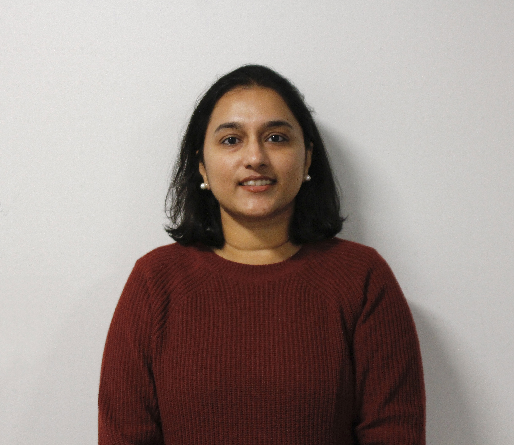

# Aswini Sivakumar

PhD Student in Computer Science · Oakland University, Rochester MI

 &nbsp;  &nbsp; 

---

## About

I am a PhD student in Computer Science at Oakland University, working at the intersection of computer vision, autonomous systems, and vision-language models. My research focuses on building systems that can perceive, reason, and act in complex real-world environments using retrieval-augmented generation and contrastive learning.

---

## News

| Date | Update |
|------|--------|
| *12.2025* | Won [SAS Hacakthon 2025](https://www.oakland.edu/news/business/2026/hackathon/) in two tracks - SAS Viya Workbench and Sustainability|
| *01.2025* | Started my PhD at Oakland University|
| *11.2024* | Won [SAS Hacakthon 2024](https://www.oakland.edu/news/business/2024/ou-business-students-continue-winning-ways-at-2024-sas-hackathon/) in Energy track|
| *03.2024* | Presented at the *Interdisciplinary Applications of AI and Data Analytics Symposium* - "Use of Chatbots in Medical Education," Oakland University|
| *06.2023* | Won [SAS Hacakthon 2023](https://www.oakland.edu/news/business/oakland-universitys-school-of-business-team-emerges-victorious-in-2023-sas-hackathon/) in Forecasting track|
<!-- | *01.2025* | Started my PhD journey at OU| -->

---

## Research Interests

- **Autonomous Driving** - End-to-end autonomous pipelines with multi-modal perception
- **Vision-Language Models** - Fine-tuning and adapting large VLMs for scene understanding, action prediction, and justification generation
- **Retrieval-Augmented Generation** - Hybrid retrieval and evaluation frameworks
- **Computer Vision & NLP** - Object detection, semantic embeddings, sentiment analysis, and biomedical text mining
- **AI Safety & Robustness** - Safety in autonomous systems
- **Applied ML** - Predictive modeling for healthcare, energy forecasting, and business analytics

---

## Education

**Ph.D. in Computer Science**
Oakland University · Rochester, MI · 2025 – Present

Working under the supervision of [Dr. Yao Qiang](https://qiangyao1988.github.io/) in the Secure, Aligned, Fair, and Ethical (SAFE) AI Research Lab.

---

**M.S. in Business Analytics**
Oakland University · Rochester, MI · *2022 – 2024*

Coursework in machine learning, AI ethics, data-driven decision making, and statistical modeling.

---

**M.B.A. in Finance**
BITS Pilani · India · *2019 – 2020*

Specialization in corporate finance, capital budgeting, and quantitative business analysis.

---

**B.Tech in Computer Science and Engineering**
Amrita University · India · *2011 – 2015*

Foundation in algorithms, software engineering, and computer systems.

---

## Experience

**Graduate Research Assistant**
Oakland University · Rochester, MI · *2023 – Present*

**Associate Engineer**
Cognizant · India · *2018 – 2020*

**System Engineer**
Tata Consultancy Services · India · *2015 – 2018*

---

## Projects

### [Medical RAG Evaluation Framework](https://github.com/AswiniS94/PubMed_RAG_Vishwa_Aswini_CSI5130)
RAGXMedicalQAEvaluator with novel Context Utilization Efficiency (CUE)  metrics. Hybrid BM25 + dense retrieval using MedCPT encoders, evaluated on PubMedQA and USPSTF clinical guidelines with DeepSeek-V3 as LLM judge.
`MedCPT` `BM25` `Weaviate` `DeepSeek-V3` `PubMedQA`

---

### [Cancer Subtype Classification](https://github.com/AswiniS94/Endometrical_Cancer_Subtypes_Prediction)
ML pipeline for endometrial cancer subtype prediction on the TCGA/UCEC dataset. Handles class imbalance via SMOTE and compares six ML models with an emphasis on parsimonious Decision Trees.
`SMOTE` `Random Forest` `TCGA` `Scikit-learn`

---

### [Explainability on transformer-based models](https://github.com/AswiniS94/Explainability_transformer_model)
Fine-tuned DistilBERT on a restaurant reviews dataset for sentiment analysis, then benchmarked three post-hoc explainability frameworks — SHAP, Transformers-Interpret, and Ferret XAI. An interactive Gradio dashboard visualizes feature attributions in real-time.
`DistilBERT` `SHAP` `Ferret XAI` `Gradio` `Transformers` `Explainability`

---

### [LinkedIn Profile NLP Classifier](https://github.com/AswiniS94/LinkedIN_Profile_Classification_using_NLP)
Classifying professional profiles using natural language processing. Feature extraction from unstructured text with  classical ML models.
`NLP` `XGBoost` `Python` `Scikit-learn`

---

### [Energy Demand Forecasting](https://github.com/AswiniS94/Forecasting_Energy_Demand)
Predictive modeling for electricity demand using time series analysis and machine learning, applied to utility grid planning and demand response.
`Time Series` `Scikit-learn` `Pandas` `Forecasting`

---

### [Housing Buy vs. Rent Decision Tool](https://github.com/AswiniS94/Housing_Buy_Vs_Rent_DecisionSupportTool)
Data-driven decision support tool for housing market analysis, incorporating mortgage rates, opportunity cost, and long-term financial projections.
`Finance` `Python` `Data Analysis`
